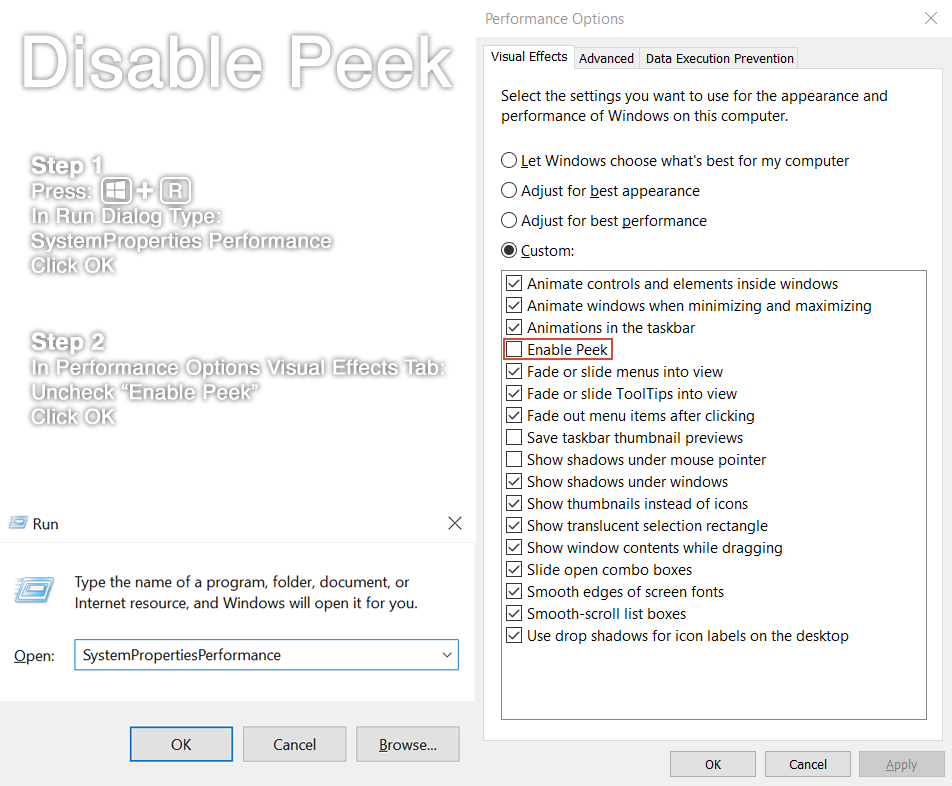
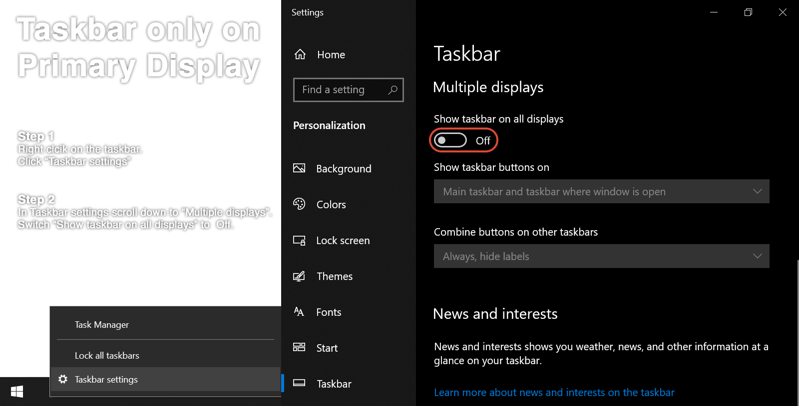

## About
Software that utilizes MPC-HC for professional looking playback of videos on a multi-screen Windows setup intended for use in video panel rooms at conventions.

## Features
- Playback Controls for MPC-HC.
- Easily adjusts MPC-HC settings for a multi-screen setup.
- Can backup current MPC-HC playlist.
- Quick access to system volume mixer.
- Utilizes MPC-HC web interface for an additional information screen that can:
  - Display Current & Upcoming Panel Information
  - Display Currently Playing Video
  - Be Customized
    - Add Images/Logos at the Bottom
    - Add & Select Fonts
    - Change Background & Text Colors

## Requirements
- Windows 7 / 8 / 8.1 / 10 / 11
- [MPC-HC](https://github.com/clsid2/mpc-hc/releases) (Version 1.9.19 or Newer)

## Recommended Windows Settings
In addition to MPC-HC settings that AMV Theater Assistant can configure for you, the following Windows settings are also recommended:

- Extended desktop instead of duplicate.
  - NOTE: When using a desktop computer set the primary monitor to the one you intend to control things from.
- Disable aero peek.
- Mute system sounds through volume mixer.
  - NOTE: Volume mixer can be accessed on the Playback Controls tab on AMV Theater Assistant.
- Only show taskbar on primary display.

## Included Libraries

[jQuery](https://jquery.com/) (2.2.4) ([MIT License](/LICENSE))

## License

AMV Theater Assistant is under the [MIT License](/LICENSE).

## Donate
<a href='https://ko-fi.com/l33tmeatwad' target='_blank'>
